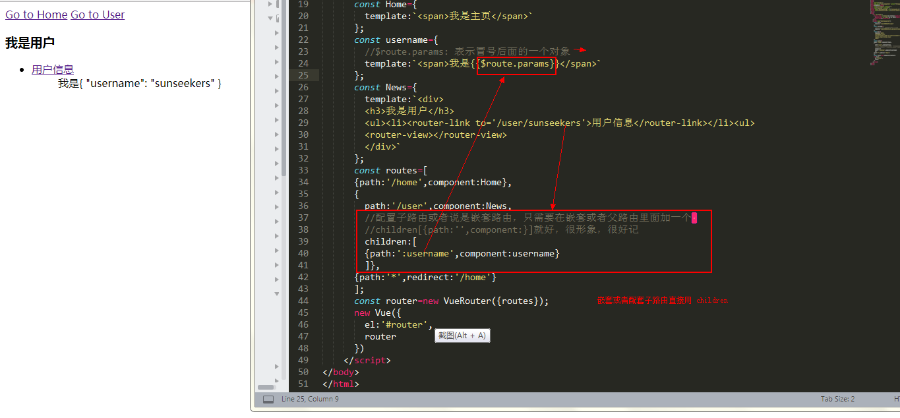

# Demo13 - vue-router

  
[查看原图](http://naotu.baidu.com/file/dbba90268bf1e5c34bfd39eaad721999?token=b39c89bd85d74046)（这是作者关于 vue-router 的百度脑图链接）
（这是作者关于 vue-router 的早期版本的脑图，一并贴上）  

*vue-router* : 简称路由，简单说就是根据不同的 url 地址，显示不同的效果  
\<router-link\> : 组件用于帮助用户进行**导航**，也就是我们传统的 \<a\> 标签经常做的事；\<a\> 的标签用 href 属性来指定导航的目标地址，而 \<router-link\> 组件则用 to 属性来定目标地址；  
\<router-view\> : 是路由的出口，组件负责**渲染**匹配到的视图，即渲染 \<router-link\> 指向的目标地址

同一个路径可以匹配多个路由，匹配的优先级就按照路由的定义顺序：谁先定义的，谁的优先级就最高。

## 1. 创建 简单的 vue-router

1. 创建组件
2. 配置路由
3. 生成路由实例

PS: \<router-link\> 和 \<router-view\> 不必成双对的出现，可根据配置的不同路由渲染到一个 \<router-view\>

## 2. 嵌套的 vue-router
实际生活中的我们经常会遇到 多层嵌套的组件组合而成，URL 中各段动态路径也按某种结构对应嵌套的各层组件  
这时候我们怎么办呐？  
其实嵌套路由很简单，只需要加上一个 children 就好，children 里面的写法和外面的一样



$route.params： 表示当前的参数即冒号后面的东西

/detail/:id/age/:age --->$route.params 表示 id 和 age 组成的对象

## 3. 路由的两种实例方法

router.push({path:'/home'}): 直接添加一个路由，表现为切换路由，往历史记录里面添加一个历史记录  
router.replace({path:'news'}): 替换路由，历史记录里面没有添加记录


### 过渡动画

本例中引入了动画，简单说就是两种形式：出现动画（进入动画）、消失动画（离开动画）  
配合第三方动画库如 animation.css 或者 Velocity.js 效果功能更好

transition 组件
```
<transition>
    运动的东西(元素，属性，路由....)
</transition>
```

## 4. 给路由定义名字
通过给 \<router-view\> 标签增加 name 属性，再在 VueRouter 中关联定义即可，如果没有定义 name 属性，则会与 default 项关联

## 5. this.$router 和 $route 的区别


也可参考 https://blog.csdn.net/wangguoyu1996/article/details/80628135