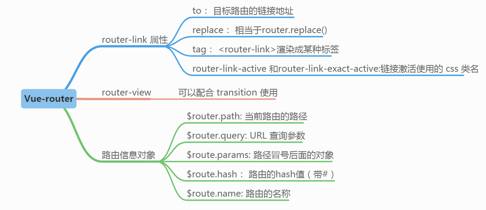

# Demo14 - vue-router 1st 简单实例
vue-router: 简称路由，根据不同的 url 地址，显示不同的效果

  

router-link : 组件用于帮助用户进行 导航 ，也就是我们传统的 a 标签经常做的事；a 的标签用 href 属性来指定导航的目标地址，而 router-link 组件则用 to 属性来定目标地址；  
router-view : 组件负责 渲染 匹配到视图,也就是渲染 router-link 指向的目标地址

同一个路径可以匹配多个路由，匹配的优先级就按照路由的定义顺序：谁先定义的，谁的优先级就最高。

## 创建 简单的 vue-router
1. 创建组件
2. 配置路由
3. 生成路由实例