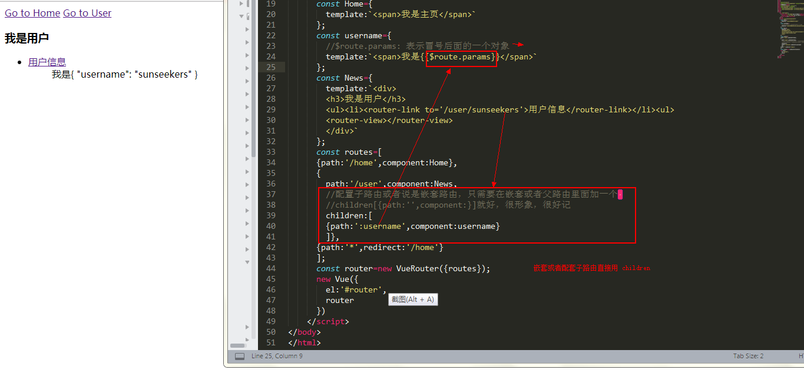

# Demo15 - vue-router 2nd
## 嵌套的 vue-router
当我们想在在路由里面再嵌套路由的时候要怎么办呐？

从代码可以看出嵌套路由很简单，只需要加上一个 children 就好，children 里面的写法和外面的一样

$route.params： 表示当前的参数即冒号后面的东西

/detail/:id/age/:age --->$route.params 表示 id 和 age 组成的对象