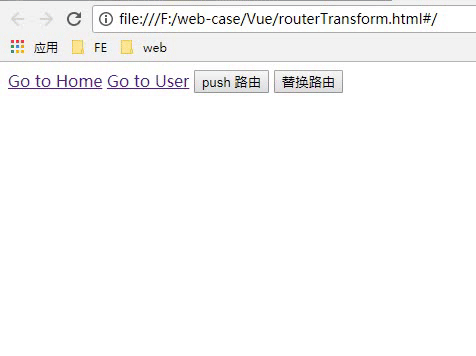

# Demo16 - vue-router 3rd
## 路由的实例方法
router.push({path:'/home'}): 直接添加一个路由，表现为切换路由，往历史记录里面添加一个历史记录

router.replace({path:'news'}): 替换路由，历史记录里面没有添加记录



引入了过渡动画，页面效果看起来好看多了

## 过渡动画
动画简单说就是两种形式出现动画（进入动画），消失动画（离开动画），配合第三方动画库如 animation.css 或者 Velocity.js 效果功能更好

transition 组件
```
<transition>
    运动的东西(元素，属性，路由....)
</transition>
```
