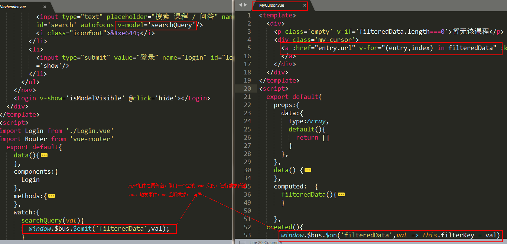

# Demo17 - 子组件之间的数据传递
众所周知，Vue 是基于组件来构建 web 应用的，组件将模块和组合发挥到了极致  
Vue 是虽说吸取了 AngularJs 的 MVVM 的思想，但是它是单向数据流的  
也就是说子组件无法直接改变父组件状态。下面总结出常用的组件消息传递的方式

PS: 以下1、2参考 https://segmentfault.com/a/1190000012103728  
&emsp;&emsp;&emsp;&ensp;3、6参考原作者的 https://github.com/sunseekers/Vue/blob/master/bus.html  
&emsp;&emsp;&emsp;&emsp;&emsp;&emsp;&emsp;&emsp;&emsp;&emsp;&ensp;和 https://github.com/sunseekers/Vue/tree/master/inheritAttris  
&emsp;&emsp;&emsp;&ensp;4、5参考 http://www.php.cn/js-tutorial-401522.html  

## 1. 父组件向子组件传递数据

## 2. 子组件修改父组件的数据

## 3. 子组件之间的数据传递（非父子组件间的通信）
不相关的组件（非父子组件）之间的通信，可以通过创建一个 Vue 的实例作为“桥”来中转  

## 4. 路由传值

## 5. 通过localStorage或者sessionStorage来存储数据