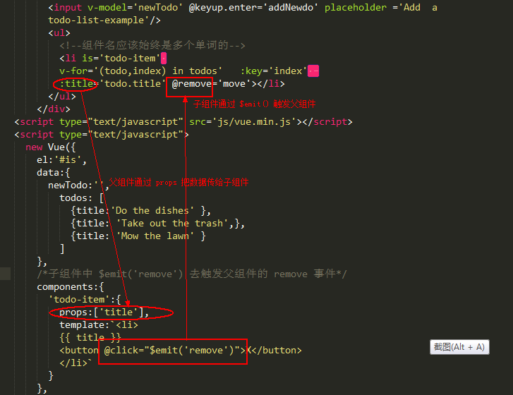

# Demo7 - is 特性
Vue.js 中的 is 属性是为了解决 dom 结构中对放入 html 的元素有限制的问题
比如针对 ul 标签而言，为了保证浏览器的正常渲染，里面必须要接上 li 的标签
此时对 li 标签加上 is 属性可以被 Vue.js 解析为对应名称的组件

## emit 方法
自定义组件中父组件通过 props 属性将数据传递给子组件，反过来子组件通过 $emit('event') 触发父组件，进而进行修改父组件的数据  
emit 特性会在 demo8 中再详细使用  

